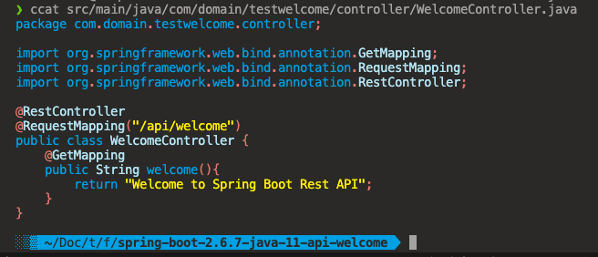
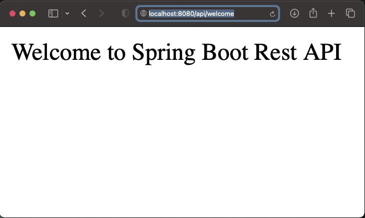

    

# SPRING-BOOT API WELCOME

### &#x1F530; Begin project

- Create Project (summary) :
-  - VSC Open Command Palate ( up + command + P)
-  - keyword "> spring", select `Spring Initializr: Create a Maven Project`
-  - Specify Spring Boot version : 2.6.6
-  - Specify project language : Java
-  - package name : com.domain
-  - Artifact ID : demo-api
-  - Specify package type : Jar
-  - Java Version : 11
-  - Choose dependencies : 
        - -> Spring Web
        - -> Spring Boot DevTools
        - -> Lombok ( function : reduces boilerplate code )

### &#x1F530; Stages and codes

    # create a directory in Visual Studio Code at path `src/main/java/com/domain/testwelcome/controller`

    # create a java file in Visual Studio Code at path `rc/main/java/com/domain/testwelcome/controller/WelcomeController.java`

    

---

### &#x1F530; Running

    ❯ mvn spring-boot:run

        [INFO] Scanning for projects...
        [INFO] 
        [INFO] ----------------------< com.domain:test-welcome >-----------------------
        [INFO] Building test-welcome 0.0.1-SNAPSHOT
        [INFO] --------------------------------[ jar ]---------------------------------
        [INFO] 
        [INFO] >>> spring-boot-maven-plugin:2.6.7:run (default-cli) > test-compile @ test-welcome >>>
        [INFO] 
        [INFO] --- maven-resources-plugin:3.2.0:resources (default-resources) @ test-welcome ---
        [INFO] Using 'UTF-8' encoding to copy filtered resources.
        [INFO] Using 'UTF-8' encoding to copy filtered properties files.
        [INFO] Copying 1 resource
        [INFO] Copying 0 resource
        [INFO] 
        [INFO] --- maven-compiler-plugin:3.8.1:compile (default-compile) @ test-welcome ---
        [INFO] Changes detected - recompiling the module!
        [INFO] Compiling 2 source files to /Users/.../spring-boot-2.6.7-java-11-api-welcome/target/classes
        [INFO] 
        [INFO] --- maven-resources-plugin:3.2.0:testResources (default-testResources) @ test-welcome ---
        [INFO] Using 'UTF-8' encoding to copy filtered resources.
        [INFO] Using 'UTF-8' encoding to copy filtered properties files.
        [INFO] skip non existing resourceDirectory /Users/.../spring-boot-2.6.7-java-11-api-welcome/src/test/resources
        [INFO] 
        [INFO] --- maven-compiler-plugin:3.8.1:testCompile (default-testCompile) @ test-welcome ---
        [INFO] Changes detected - recompiling the module!
        [INFO] Compiling 1 source file to /Users/.../spring-boot-2.6.7-java-11-api-welcome/target/test-classes
        [INFO] 
        [INFO] <<< spring-boot-maven-plugin:2.6.7:run (default-cli) < test-compile @ test-welcome <<<
        [INFO] 
        [INFO] 
        [INFO] --- spring-boot-maven-plugin:2.6.7:run (default-cli) @ test-welcome ---
        [INFO] Attaching agents: []
        12:04:35.550 [Thread-0] DEBUG org.springframework.boot.devtools.restart.classloader.RestartClassLoader - Created RestartClassLoader org.springframework.boot.devtools.restart.classloader.RestartClassLoader@7a6768da

        .   ____          _            __ _ _
        /\\ / ___'_ __ _ _(_)_ __  __ _ \ \ \ \
        ( ( )\___ | '_ | '_| | '_ \/ _` | \ \ \ \
        \\/  ___)| |_)| | | | | || (_| |  ) ) ) )
        '  |____| .__|_| |_|_| |_\__, | / / / /
        =========|_|==============|___/=/_/_/_/
        :: Spring Boot ::                (v2.6.7)

        2024-03-13 12:04:35.950  INFO 75171 --- [  restartedMain] c.d.testwelcome.TestWelcomeApplication   : Starting TestWelcomeApplication using Java 11.0.14 on Powercommerces-MacBook-Pro-7.local with PID 75171 (/Users/.../spring-boot-2.6.7-java-11-api-welcome/target/classes started by powercommerce in /Users/.../spring-boot-2.6.7-java-11-api-welcome)
        2024-03-13 12:04:35.951  INFO 75171 --- [  restartedMain] c.d.testwelcome.TestWelcomeApplication   : No active profile set, falling back to 1 default profile: "default"
        2024-03-13 12:04:35.971  INFO 75171 --- [  restartedMain] .e.DevToolsPropertyDefaultsPostProcessor : Devtools property defaults active! Set 'spring.devtools.add-properties' to 'false' to disable
        2024-03-13 12:04:35.972  INFO 75171 --- [  restartedMain] .e.DevToolsPropertyDefaultsPostProcessor : For additional web related logging consider setting the 'logging.level.web' property to 'DEBUG'
        2024-03-13 12:04:36.369  INFO 75171 --- [  restartedMain] o.s.b.w.embedded.tomcat.TomcatWebServer  : Tomcat initialized with port(s): 8080 (http)
        2024-03-13 12:04:36.375  INFO 75171 --- [  restartedMain] o.apache.catalina.core.StandardService   : Starting service [Tomcat]
        2024-03-13 12:04:36.375  INFO 75171 --- [  restartedMain] org.apache.catalina.core.StandardEngine  : Starting Servlet engine: [Apache Tomcat/9.0.62]
        2024-03-13 12:04:36.398  INFO 75171 --- [  restartedMain] o.a.c.c.C.[Tomcat].[localhost].[/]       : Initializing Spring embedded WebApplicationContext
        2024-03-13 12:04:36.398  INFO 75171 --- [  restartedMain] w.s.c.ServletWebServerApplicationContext : Root WebApplicationContext: initialization completed in 426 ms
        2024-03-13 12:04:36.544  INFO 75171 --- [  restartedMain] o.s.b.d.a.OptionalLiveReloadServer       : LiveReload server is running on port 35729
        2024-03-13 12:04:36.563  INFO 75171 --- [  restartedMain] o.s.b.w.embedded.tomcat.TomcatWebServer  : Tomcat started on port(s): 8080 (http) with context path ''
        2024-03-13 12:04:36.569  INFO 75171 --- [  restartedMain] c.d.testwelcome.TestWelcomeApplication   : Started TestWelcomeApplication in 1.014 seconds (JVM running for 1.267)
        2024-03-13 12:04:53.629  INFO 75171 --- [nio-8080-exec-1] o.a.c.c.C.[Tomcat].[localhost].[/]       : Initializing Spring DispatcherServlet 'dispatcherServlet'
        2024-03-13 12:04:53.630  INFO 75171 --- [nio-8080-exec-1] o.s.web.servlet.DispatcherServlet        : Initializing Servlet 'dispatcherServlet'
        2024-03-13 12:04:53.632  INFO 75171 --- [nio-8080-exec-1] o.s.web.servlet.DispatcherServlet        : Completed initialization in 2 ms

#### Open Browser

    URL http://localhost:8080/api/welcome

    

---

    

### &#x1FAA7; Notes :

    ❯ mvn --version

        Apache Maven 3.8.6 (84538c9988a25aec085021c365c560670ad80f63)
        Maven home: /opt/homebrew/Cellar/maven/3.8.6/libexec
        Java version: 11.0.14, vendor: BellSoft, runtime: /Users/.../.sdkman/candidates/java/11.0.14-librca
        Default locale: en_US, platform encoding: UTF-8
        OS name: "mac os x", version: "13.3.1", arch: "aarch64", family: "mac"

    ❯ java --version

        openjdk 11.0.14 2022-01-18 LTS
        OpenJDK Runtime Environment (build 11.0.14+9-LTS)
        OpenJDK 64-Bit Server VM (build 11.0.14+9-LTS, mixed mode)